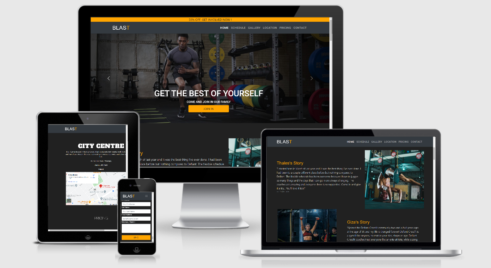

# [Welcome to Blast Gym](https://josemachado-ce.github.io/Blast)

This website has been created in order to show the possibility of finding a good gym with an easy access to it. 
The gym is located in the centre of Dublin.
Please feel free to go to my Github profile and leave your feedback there.
Thank you

---
## Table of Contents
* [User Experience](#ux)
    * [User Goals](#user-goals)
    * [User Stories](#user-stories)
    * [Site Owners Goals](#site-owners-goals)
    * [User Requirements and Expectations](#user-requirements-and-expectations)
        * [Requirements](#requirements)
        * [Expectations](#expectations)
    * [Design Choices](#design-choices)
        * [Fonts](#fonts)
        * [Icons](#icons)
        * [Colors](#colors)
        * [Structure](#structure)
* [Wireframes](#wireframes)
* [Features](#features)
    * [Existing Features](#existing-features)
    * [Features to be implemented](#features-to-be-implemented)
* [Technologies used](#technologies-used)
    * [Languages](#languages)
    * [Tools and Libraries](#tools-and-libraries)
* [Testing](#testing)
* [Deployment](#deployment)
* [Credits](#credits)

  --- 
## User Experience
### User Goals
  * A website with enough content to understand the service being offered
  * A website with good color contrast 
  * Information about who serves the service
  * Contact details
  * Form details to get in Contact
  * Quality information about prices
  * Customers Testemonials
### User Stories
  * A user wants to easily find the service details
  * A user wants to quickly find what they are looking Form
  * A user wants to find other customers reviews to feel confident themselves
  * A user wants to easily find the gym location
  * A user wants to navigate smooth on the webiste displayed on tablets and cellphones
  * A user wants to find different social medias associated to the website
### Site Owners Goals
  * Advertise the Gym
  * Bring more people to join in the gym
  * Bring a new gym to irish society
### User Requirements and Expectations
#### Requirements
  * Easy to navigate
  * Appropriate Content about the service
  * Good color contrast 
  * Quick way to contact the seller
  * Good information on pricing
#### Expectations
  * Proper information about location
  * Relevant social medias
  * Nice gallery to call customer attention
  * Links that dont brake
  * Quick return from seller
### Design Choices
#### Fonts
  * The fonts used one the website have been selected from [Google fonts](https://fonts.google.com/) which will proabably work on almost all web browsers
#### Icons
  * All icons used on this website have been selected from [Font Awesome](https://fontawesome.com/)
#### Colors
  * I had the help of a few websites for giving the colors such as [Color Hunt](https://https://colorhunt.co/)
  * I also used the website [Coloors](https://coloors.co/) for make the colors pallet.
  
  * #212121 - Color used for background color 
  * #fff - White color used on the website
  * #ffa500 - orange used on different parts of the website
  * #050505 - Black color for a few parts of the website
  * #FD1D1D - Redfor instagram icon hover
  * #4267B2 - Blue for facebook icon hover
  * #1DA1F2 - Blue for twitter icon hover   

#### Structure
  * I have used the [Bootstrap](https://getbootstrap.com/) structure to give form to this website.

## Wireframes

I have decided to use [Balsamiq Wireframes](https://balsamig.com) to create 3 different wireframes for my website.

### [Desktop Wireframe](Wireframes/Desktop_WF1.pdf)
### [Iphone Wireframe](Wireframes/Iphone_WF1.pdf)
### [Tablet Wireframe](Wireframes/Tablet_WF1.pdf)

## Features
### 1. Existing Features
#### Navigation
The navigation bar that I have used on the website is one of the option that can be found on bootstrap website. It's a navbar with a brand logo on the top left and 6 more nav itens on the top right. It's a sticky navbar so, the customer will have the navbar following the cursor whichever the way the customer scrools.

#### Hero image
I have decided to come up with a hero image to main page. The hero image structure has been taken from bootstrap website. It contains 3 pictures with a button on each slide.

#### Testemonials
On the testemonials section, I decided to go with 2 customers testemonials and their respective pictures. After the 2 testemonials I put up a iframe which is a video from youtube with a professional athlete to motivate even more the customers when they surf the website.

#### Schedule
On the schedule area I have given the schedule from monday to friday and the schedule for saturdays and bank holidays. Along with the schedule I have put 2 big banners to motivate even more people to sign up.

#### Gallery
For this area of the website, I have added a carousel which structure has been taken from bootstrap. This carousel contains 3 pictures and the purpose of this carousel is bring the customer attention to the website and then sign up.

#### Location
On the location I have only put the address of the GYM with a map right below the address. The map is an iframe taken from google maps.

#### Pricing
On pricing, the gym has 3 plans which the customer has the power of choosing whatever plan suits them best. 

#### Contact
On contact, I have added a contact form which structure has been taken from bootstrap. A photo has also been added right next to the form. The purpose of this photo is to make clear what the customer already wants which is be healthier.

### Features to be implemented
* Join in page after clicking the join button
* Links to external partners
* Database to store all customers data
* Chatbot to make user experience smoothier 

## Technologies used
### Languages
* [HTML5](https://en.wikipedia.org/wiki/HTML5) - used to create the HTML base.
* [CSS](https://en.wikipedia.org/wiki/CSS) - used to give style to the HTML5 elements.
* [Google Fonts](https://fonts.google.com/)

### Tools
* [Bootstrap](https://getbootstrap.com) - I used bootstrap for the navigation bar, carousel, pricing and footer
* [Font Awesome](https://fontawesome.com/) - I used font Awesome for Icons.
* [Gitpod](https://www.gitpod.io/) - I used gitpod for better tracebility.
* [Github](https://github.com/) - I used github for creating my repository
* [Git](https://git-scm.com/) - I used git as version control for better record of my coding.
* [Balsamic](https://balsamiq.com/wireframes/) - I Used it to create the Wireframes
* [Ami Mockup Image]((http://ami.responsivedesign.is/)) - I used it to create the mockup image with the website displayed in 4 different device frames.
## Testing
### Navigation bar

* **Plan**    
I want to include a navigation bar which will be sticky top.
The customer will have the experience of having the navbar whichever the way they go. It give a facility to go to different areas on the website without going to the top of the page with a normal navbar. 
On small screens the navbar collapses making the customer experience smoothier.

* **Implementation**   
The whole navbar structure has been taken from bootstrap which makes it better displayed on different screens. I have used also css to overwrite a few bits of code in order to make what I wanted.

* **Test**    
To test it I have opened the website on different browsers just to see if the navbar would not get off. I also changed the size of the screen using inspect just to see if the navbar would change according to the size of the screen. It was also checked the hambuguer button when the screen had been displayed on mobile screens.

* **Result**    
The navigation bar shows nicely like expected on all browsers and devices. 
I had to notice that the Navigation bar when collapsed and turning into the hamburguer button was a bit too close to the edge of the page so, I had to move it a bit to the left to make better the user experience.
All the link was working as well. 

* **Verdict**    
The test has passed all the criteria and works like planned.

### Modals
* **Plan**    
I want to implement 2 modals which are when a customer click on the button "join in" the button takes the customer to a diferent page where the customer could fill out all their details and then proceed with the registration. The other modal would be a feedback to the customer in case they fill out the forms not properly.

* **Implementation**    
I do not have the proper skills to add these changes I believe. I had to be trained on JS in order to have this feedback to the customer and I believe that I had to know some type of back end and cloud in order to create this sign up area for the customer. 
I did use bootstrap to link the "join in" button on the website to take the customer to the contact form area.

* **Test**    
I have tested the modal on various devices and browsers. 
The modal was very successfull taking the customer to where I wanted.

* **Result**    
The modal opened where and when it was supposed to happen.

* **Verdict**    
The modal works as planned and met all the criteria. 

### Contact Form 
* **Plan**    
I wanted to have a contact form that could take a few details from the customer and then be sent to the website administrator. This would have a "send" button which would do the job to the send the data do the website administration.

* **Implementation**    
To go forward with this form I have taken the structure from the bootstrap website and I just had to change a few things to look like what I wanted. The form has 4 spaces to be filled out by the customer. It comes with a button as well.

* **Test**    
When I tested the form I noticed that it would not tell the customer in case they filled out the form wrongly. I believe that some JS skill were missing in order to do this.

* **Result**    
The result is still needs the JS code to make it work as planned.

* **Verdict**    
The form does not meet all the criteria and works as planned. 

### Bugs

#### Form validation

* **Bug**    
The customer is able to submit the form without filling all necessary information on the form. This is not the expected experience for the customer.

* **Fix**        
JS skills were missing to do a better job here. A piece of JS code has been given to me by my mentor in order to overturn this problem.

* **Verdict**    
Bug was resolved and form now works as planned. 

#### Hero Image

* **Bug**    
The hero image looked very good on big screens but it would not look that good when the screen reduced size.

* **Fix**    
After talking to my mentor we came up with a solution in order to fix this problem which was changing the background-attachment to scroll on mobile.

* **Verdict**    
Image now shows nicely on all devices and browsers.

#### Hamburger dropdown menu

* **Bug**    
On mobile devices the navigation bar would collapse but I noticed that it would not open after clicking on the button.

* **Verdict**   
After some researchs I could verify that my JS code from boostrap was wrong so I have fixed it and then the hambuguer button was working and openning normally.

#### Icons

* **Bug**    
The socia media icons was not being displayed properly on mobile screens. It would not bring a good experience to the user when surfing the website.

* **Fix**    
I made it look smaller on mobile screen and I added a space between each icon.

* **Verdict**    
Icons now show nicely next to each other on all devices and browsers. 

#### Navigation menu on smaller screensizes 

* **Bug**    
I noticed the same bug mentioned above with the button not working properly after clicking the button.

* **Fix**        
I fixed the JS code which has provided by Bootstrap.

* **Verdict**    
Bug was solved making the user experience good.

## Deployment

This project has been deployed with GitHub by executing the following steps.
After writing the code I would save and then I would commit it and finally I would push it to GitHub.

1. Navigate to the repository on github and click **Settings**.
1. From there, go to the **Source section** within the Github Pages section.
1. Select **master branch** on the dropdown menu, and click save.
1. Now the website is live on **https://github.com/JoseMachado-CE/Blast**
1. Any time commits and pushes are sent to Github, the Github Pages site should update shortly after.

To run the project locally:

1. Click the **green Clone or Download button** on the Github Repository
1. Using the **Clone with HTTPS option**, copy the link displayed.
1. Open your IDE, and ensure the Git Terminal is open.
1. Change the working directory to the location where the cloned directory is to go.
1. Use the **"git clone" command** and paste the url copied in the second step.

## Credits

I used the [Flyefit](https://www.flyefit.ie/) website for inspirational ideas.
Some of the images of the website have been taken from [google images](https://google.com) and a few other images have been given to me through my girlfriend who does Crossfit.
One of the 2 iframe has been take from [google maps](https://www.google.com/maps/) and the other iframe was taken from [youtube](https://youtube.com).

I wanted to thank my mentor Simen, for giving me all the support needed to finish the website.
I wanted to thank my girlfriend for letting me use my free time after work to get really involved in my project.
I wanted to thank also Code Institute and Slack for all support.
And God for make this all achieveable.

  

